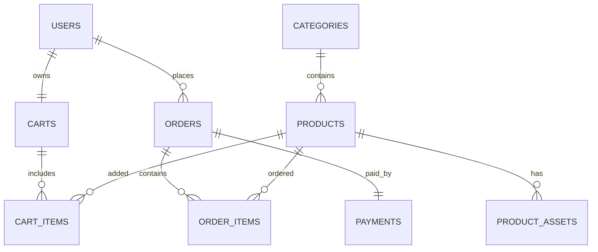

# Mini E-commerce Demo – MySQL Schema & ERD

---

## 1️⃣ SQL Schema (MySQL 8.x)

> Engine: InnoDB | Charset: utf8mb4

---

### users

```sql
CREATE TABLE users (
  id CHAR(36) PRIMARY KEY,
  email VARCHAR(255) UNIQUE NOT NULL,
  full_name VARCHAR(255),
  created_at TIMESTAMP DEFAULT CURRENT_TIMESTAMP
) ENGINE=InnoDB DEFAULT CHARSET=utf8mb4;
```

---

### categories

```sql
CREATE TABLE categories (
  id CHAR(36) PRIMARY KEY,
  name VARCHAR(255) NOT NULL
) ENGINE=InnoDB DEFAULT CHARSET=utf8mb4;
```

---

### products

```sql
CREATE TABLE products (
  id CHAR(36) PRIMARY KEY,
  name VARCHAR(255) NOT NULL,
  description TEXT,
  price DECIMAL(10,2) NOT NULL,
  stock INT DEFAULT 0,
  category_id CHAR(36),
  created_at TIMESTAMP DEFAULT CURRENT_TIMESTAMP,
  CONSTRAINT fk_product_category
    FOREIGN KEY (category_id) REFERENCES categories(id)
) ENGINE=InnoDB DEFAULT CHARSET=utf8mb4;
```

---

### product_assets

```sql
CREATE TABLE product_assets (
  id CHAR(36) PRIMARY KEY,
  product_id CHAR(36) NOT NULL,
  asset_url TEXT NOT NULL,
  is_main BOOLEAN DEFAULT FALSE,
  CONSTRAINT fk_asset_product
    FOREIGN KEY (product_id) REFERENCES products(id)
    ON DELETE CASCADE
) ENGINE=InnoDB DEFAULT CHARSET=utf8mb4;
```

---

### carts

```sql
CREATE TABLE carts (
  id CHAR(36) PRIMARY KEY,
  user_id CHAR(36) UNIQUE,
  status VARCHAR(20) DEFAULT 'active',
  created_at TIMESTAMP DEFAULT CURRENT_TIMESTAMP,
  CONSTRAINT fk_cart_user
    FOREIGN KEY (user_id) REFERENCES users(id)
) ENGINE=InnoDB DEFAULT CHARSET=utf8mb4;
```

---

### cart_items

```sql
CREATE TABLE cart_items (
  id CHAR(36) PRIMARY KEY,
  cart_id CHAR(36) NOT NULL,
  product_id CHAR(36) NOT NULL,
  quantity INT NOT NULL,
  price_at_time DECIMAL(10,2) NOT NULL,
  CONSTRAINT fk_cartitem_cart
    FOREIGN KEY (cart_id) REFERENCES carts(id)
    ON DELETE CASCADE,
  CONSTRAINT fk_cartitem_product
    FOREIGN KEY (product_id) REFERENCES products(id)
) ENGINE=InnoDB DEFAULT CHARSET=utf8mb4;
```

---

### orders

```sql
CREATE TABLE orders (
  id CHAR(36) PRIMARY KEY,
  user_id CHAR(36) NOT NULL,
  total_price DECIMAL(10,2) NOT NULL,
  status VARCHAR(20) DEFAULT 'pending',
  created_at TIMESTAMP DEFAULT CURRENT_TIMESTAMP,
  CONSTRAINT fk_order_user
    FOREIGN KEY (user_id) REFERENCES users(id)
) ENGINE=InnoDB DEFAULT CHARSET=utf8mb4;
```

---

### order_items

```sql
CREATE TABLE order_items (
  id CHAR(36) PRIMARY KEY,
  order_id CHAR(36) NOT NULL,
  product_id CHAR(36) NOT NULL,
  quantity INT NOT NULL,
  price DECIMAL(10,2) NOT NULL,
  CONSTRAINT fk_orderitem_order
    FOREIGN KEY (order_id) REFERENCES orders(id)
    ON DELETE CASCADE,
  CONSTRAINT fk_orderitem_product
    FOREIGN KEY (product_id) REFERENCES products(id)
) ENGINE=InnoDB DEFAULT CHARSET=utf8mb4;
```

---

### payments
skip

```sql
CREATE TABLE payments (
  id CHAR(36) PRIMARY KEY,
  order_id CHAR(36) UNIQUE NOT NULL,
  method VARCHAR(50),
  status VARCHAR(20),
  created_at TIMESTAMP DEFAULT CURRENT_TIMESTAMP,
  CONSTRAINT fk_payment_order
    FOREIGN KEY (order_id) REFERENCES orders(id)
) ENGINE=InnoDB DEFAULT CHARSET=utf8mb4;
```

---

## 2️⃣ ERD (dùng trực tiếp cho slide – Mermaid)



---

## 3️⃣ Gợi ý trình bày slide (rất dễ ăn điểm)

* Slide 1: ERD tổng thể (ảnh Mermaid)
* Slide 2: 1:N (Category → Product)
* Slide 3: N:N (Cart ↔ Product qua CartItem)
* Slide 4: ERP mindset (Order / OrderItem / Payment)

> Nếu cần, có thể export ERD này sang draw.io hoặc PNG cho PowerPoint.
